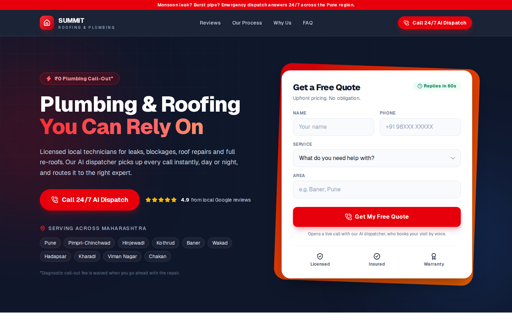

# Summit Voice: Multi-Agent Voice AI Receptionist

A voice AI phone desk for **Summit Roofing & Plumbing**, a home-services business. A caller presses **Call** on the website and talks to three AI agents that pass the call between themselves, just like a real front desk:

| Agent | Role | What it does |
|-------|------|--------------|
| **Ava** | Receptionist | Greets the caller, answers common questions, finds out why they are calling, and transfers them |
| **Jordan** | Sales | Gives rough price ranges, books a free on-site consultation, and logs the lead |
| **Taylor** | Support | Handles leaks, repairs and emergencies, and logs a support ticket |

Built for **Project Exhibition I** at **VIT Bhopal University**.

**Live site:** https://final-website-three-liart.vercel.app/



---

## How it works

```
Browser (Next.js on Vercel)
   │  1. Press "Call" → /api/token issues a LiveKit token for a fresh room
   │     support_triage_room_<random>
   ▼
LiveKit Cloud room ◄──────────────────────────────────────────────┐
   │  2. Ava auto-joins every new room                            │
   ▼                                                              │
Ava (agent.py) ── transfer_to_sales / transfer_to_support ──► dispatches
   │                                                       Jordan or Taylor
   ▼                                                       into the SAME room
Jordan (sales_agent.py) / Taylor (support_agent.py)
   │  3. book_consultation / create_support_ticket
   ▼
n8n webhooks → Leads / Tickets sheets (or printed to the terminal in mock mode)
```

- **Every call gets its own room.** Ava registers with no `agent_name`, so LiveKit sends her into every new room, and she listens to the first participant only. A fresh room per call keeps two visitors from sharing one receptionist.
- **Handoffs keep the caller connected.** When Ava transfers a call, she says one handoff sentence, asks LiveKit to dispatch the specialist into the same room with a short JSON note (caller name, reason, summary), then leaves. The caller just hears a new voice pick up, already knowing who they are.
- **Calls end cleanly.** After a booking or ticket, the agent says goodbye and then deletes the room on the server, so the website shows "Call ended" instead of leaving the caller alone in the room.
- **Each agent has its own voice**, so every handoff is easy to hear.

## Tech stack

| Layer | Technology |
|-------|-----------|
| Real-time audio | LiveKit Cloud (WebRTC) |
| Agent framework | LiveKit Agents 0.12.21 (Python) |
| Voice activity detection | Silero VAD |
| Speech-to-text | `whisper-large-v3` on Groq |
| Language model | `openai/gpt-oss-20b` on Groq |
| Text-to-speech | Cartesia `sonic-2` |
| Lead and ticket logging | n8n webhooks (optional) |
| Website | Next.js 16, React 19, Tailwind CSS v4, LiveKit Components |
| Hosting | Vercel (website), any machine with Python for the agents |

## Repository layout

```
.
├── agent.py              Ava, the receptionist (auto-dispatched)
├── sales_agent.py        Jordan, sales (explicit dispatch: "sales-agent")
├── support_agent.py      Taylor, support (explicit dispatch: "support-agent")
├── common.py             Shared model config, voices, and the handoff logic
├── requirements.txt      Pinned Python dependencies
├── .env.example          Template for the agents' keys (copy to .env)
├── run_all.sh            Starts all three agents in one terminal
├── Dockerfile            Container image for the agents
├── n8n/                  n8n workflow + Leads/Tickets column headers
└── website/              Next.js site with the call modal (deployed on Vercel)
    ├── app/page.tsx              Landing page
    ├── app/api/token/route.ts    Issues a LiveKit token + fresh room per call
    └── components/AICallModal.tsx  In-browser call UI
```

---

## Getting started

### Prerequisites

- Python 3.11 (recommended for LiveKit Agents 0.12)
- Node.js 20 or newer
- Free accounts on [LiveKit Cloud](https://cloud.livekit.io), [Groq](https://console.groq.com) and [Cartesia](https://play.cartesia.ai)
- Optional: [n8n](https://n8n.io) for saving leads and tickets

The website and the agents **must use the same LiveKit Cloud project**.

### 1. Run the voice agents

```bash
git clone https://github.com/sohamshinde1937/Project-exhibition.git
cd Project-exhibition
python3.11 -m venv .venv
source .venv/bin/activate
pip install --upgrade pip
pip install -r requirements.txt
cp .env.example .env
```

Open `.env` and fill in your keys:

| Variable | Required | Purpose |
|----------|----------|---------|
| `LIVEKIT_URL` | Yes | `wss://<your-project>.livekit.cloud` |
| `LIVEKIT_API_KEY` | Yes | LiveKit project API key |
| `LIVEKIT_API_SECRET` | Yes | LiveKit project API secret |
| `GROQ_API_KEY` | Yes | Speech-to-text and language model |
| `CARTESIA_API_KEY` | Yes | Text-to-speech |
| `N8N_LEAD_WEBHOOK_URL` | No | Where Jordan sends booked leads |
| `N8N_TICKET_WEBHOOK_URL` | No | Where Taylor sends support tickets |

Download the voice-detection model once:

```bash
python agent.py download-files
```

Then start each agent in its own terminal tab (activate the venv in each one first):

```bash
python agent.py dev
```

```bash
python sales_agent.py dev
```

```bash
python support_agent.py dev
```

Or start all three in one terminal with `./run_all.sh` (production `start` mode).

### 2. Run the website

```bash
cd website
npm install
cp .env.example .env.local
npm run dev
```

Put the same three LiveKit values in `.env.local`:

```
LIVEKIT_URL=wss://your-project.livekit.cloud
LIVEKIT_API_KEY=your-api-key
LIVEKIT_API_SECRET=your-api-secret
```

Open http://localhost:3000 and press **Call**. Allow microphone access when the browser asks.

### 3. Deploy the website to Vercel

1. Import this repository in Vercel and set **Root Directory** to `website`.
2. Under **Settings → Environment Variables**, add `LIVEKIT_URL`, `LIVEKIT_API_KEY` and `LIVEKIT_API_SECRET` (no `NEXT_PUBLIC_` prefix; the token route passes the URL to the browser).
3. Deploy. The agents keep running on your own machine and connect out to LiveKit Cloud, so no ports need to be opened.

### 4. (Optional) Connect n8n

Import `n8n/summit-n8n-workflow.json` into n8n. It exposes two webhooks, `sales-lead` and `support-ticket`, that append rows to Leads and Tickets sheets (`n8n/*.csv` show the columns). Put the webhook URLs in `.env`, for example `http://localhost:5678/webhook/support-ticket`. With the variables left empty, leads and tickets are printed in the agent's terminal instead.

---

## Example call

1. Ava: *"Hi, thank you for calling Summit Roofing and Plumbing. How can I help you today?"*
2. Caller: *"I'd like a quote for a new water heater."*
3. Ava takes the caller's name and transfers them to **Jordan**, who greets them by name, gives a rough, non-binding price range, and books a free consultation.
4. Jordan reads back the booking, says goodbye, and the call ends on its own.

A caller who reports a leak or burst pipe is sent to **Taylor** instead, who collects the address and urgency and reads out a ticket number. Jordan can also hand an emergency straight to Taylor.

## Configuration

Model names and voices live in `common.py` and can be overridden in `.env`:

| Variable | Default |
|----------|---------|
| `GROQ_LLM_MODEL` | `openai/gpt-oss-20b` |
| `GROQ_STT_MODEL` | `whisper-large-v3` |
| `CARTESIA_TTS_MODEL` | `sonic-2` |
| `RECEPTIONIST_VOICE_ID`, `SALES_VOICE_ID`, `SUPPORT_VOICE_ID` | One distinct Cartesia voice per agent |

## Troubleshooting

| Problem | Fix |
|---------|-----|
| `Missing required environment variable(s)` | `.env` is missing or a key is empty |
| Nobody answers the call | Make sure Ava (`agent.py`) is running and the website and agents use the same LiveKit project |
| `ImportError` mentioning `httpx` or `openai` | Run `pip install "openai>=1.60,<2"` (already pinned in `requirements.txt`) |
| `CERTIFICATE_VERIFY_FAILED` on macOS | Run `Install Certificates.command` from your Python 3.11 folder in Applications |
| Transfer never happens | Make sure `sales_agent.py` and `support_agent.py` are running too |

## Security

Never commit `.env` or `.env.local`. API keys belong only in those local files and in Vercel's environment variables. The browser never sees the LiveKit secret; it only receives a short-lived access token from `/api/token`.

---

## Team

| Name |
|------|
| Soham Sudarshan Shinde |
| Riya Uppal |
| Rugved Shrikant Choudhari |
| Atharv Nimbalkar |
| Dhananjay Naik |

**Guide:** Dr. Sharmila Joseph
**Program Chair:** Dr. Vikas Panthi

Project Exhibition I, VIT Bhopal University.

## Notes

Summit Roofing & Plumbing is a demo business made up for this project. Prices quoted by the agents (in rupees) are rough examples, and the business details and reviews shown on the website are illustrative.
